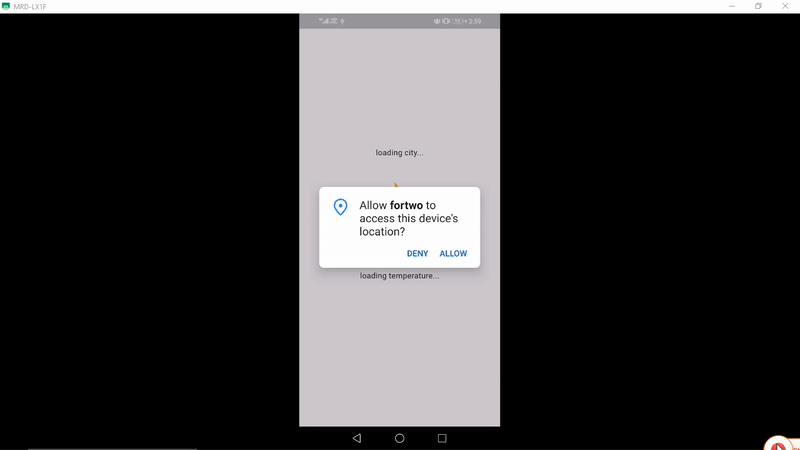

# 🚀 ForTwo

# Description

A weather app making use of an open source API to get your location and different animations depending on the weather conditions.

---

## 🖼️ Demo

---

## 🧠 Tech Stack

**Frontend:** Dart, Flutter

**Other Tools:** Git, HTTP, Geocoding, Geolocator

**App Animations:** Lottie animations

**Open Souce API:** https://openweathermap.org/

---

## ⚙️ Setup Instructions

### 1. Clone the repo

git clone https://github.com/devdeejay27/fortwo.git

cd fortwo

### 2. Install dependencies

flutter clean

flutter pub get

### 3. Run the app in terminal

flutter run

## 👨‍💻 Author

Chukwudumeje Obieli

@devdeejay27

📧 dum_obieli@yahoo.com
